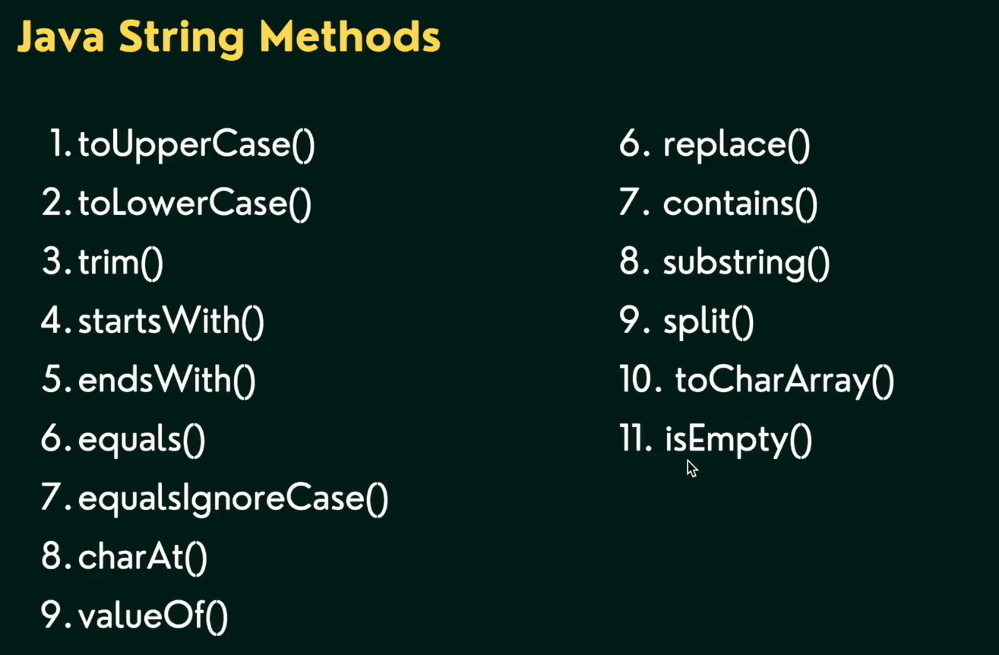

This repository is created to build a code vault for DSA questions in Java.

# Java notes
Data types are divided into two groups:

Primitive data types - includes **byte, short, int, long, float, double, boolean and char**

Non-primitive data types - such as **String, Arrays and Classes**

```
Data Type	Size	    Description
byte	    1 byte	    Stores whole numbers from -128 to 127
short	    2 bytes	    Stores whole numbers from -32,768 to 32,767
int	        4 bytes	    Stores whole numbers from -2,147,483,648 to 2,147,483,647
long	    8 bytes	    Stores whole numbers from -9,223,372,036,854,775,808 to 9,223,372,036,854,775,807
float	    4 bytes	    Stores fractional numbers. Sufficient for storing 6 to 7 decimal digits
double	    8 bytes	    Stores fractional numbers. Sufficient for storing 15 decimal digits
boolean	    1 bit	    Stores true or false values
char	    2 bytes	    Stores a single character/letter or ASCII values
```

## Arrays

### 1D Array         
    int age[]; //declaration
    age = new int[5]; // allocation
    int age[] = new int[5]; // declaration and allocation of memory
    age[0] = 5;
    age[4] = 2;

    int marks[] = {12,54,23,44,65};`

str.length is used to return the length of the array

        System.out.println(age.length);

## 2D Array

```
int marks[][] = new int[2][3];

        marks[0][0] = 12;
        marks[0][1] = 13;
        marks[0][2] = 54;
        marks[1][0] = 65;
        marks[1][1] = 76;
        marks[1][2] = 43;

        int markss[][] = {
            {12,13,54},
            {65,76,43}
        };

```

## Math


    int a = 4;
    int b = 7;    

    System.out.println("Max :"+Math.min(a, b));
    System.out.println("Min :"+Math.max(16,44));
    System.out.println("Pow :"+Math.pow(3,4));
    System.out.println("Sqrt :"+Math.sqrt(16));
    System.out.println("Abs :"+Math.abs(-16));
    System.out.println("Random :"+Math.random());
    System.out.println("Floor :"+Math.floor(16.4));
    System.out.println("Ceil :"+Math.ceil(16.4));
    System.out.println("Round :"+Math.round(16.5));
    System.out.println("Random number between 1 to 100 :"+Math.round(Math.random()*100));


### Output

>
>Max :4
>
>Min :44
>
>Pow :81.0
>
>Sqrt :4.0
>
>Abs :16
>
>Random :0.03490348409271027
>
>Floor :16.0
>
>Ceil :17.0
>
>Round :17
>
>Random number between 1 to 100 :56
>

## String


In java, String is basically an object that represents a sequence of char values. An array of character works same as Java string.

### How to create Java string

- By string literal

`String name = "Zia";`

We use string a lot, so String literals are created in special area called **String constant pool** in the **Heap memory**. Multiple references with same value will point to the memory space in the string pool.


 - By new keyword

 `    String newName = new String("Zia");`

When a string is created using new keyword, the object is stored in the Heap menory(and not the string pool area)

### == operator

        String name = "Zia";
        String sameName = "Zia";
        String newName = new String("Zia");

        if(name == sameName){
            System.out.println("Both are same"); // OP:- Both are same
        }

        if(name == newName){
            System.out.println("Both are same");
        }else{
            System.out.println("Both are not same");// OP:- Both are not same
        }


**== operator** in case of objects, checks for references. As name and sameName points to the same string literal we get output as same.Whereas when we check name and newName, they point to different memomry location hence we get, not same.

In case of primitive types, it checks for values
```
    int age = 14;
    int marks = 14;

    if(age==marks) 
    System.out.println("true");//true
```

### Comparing two strings in java

String class provides the following two methods for equality check.
 - public boolean equals(Object another) compares this string to the specified object

  - public boolean equalsIgnoreCase(Object another) compares this string to the specified object, ignoring case.

